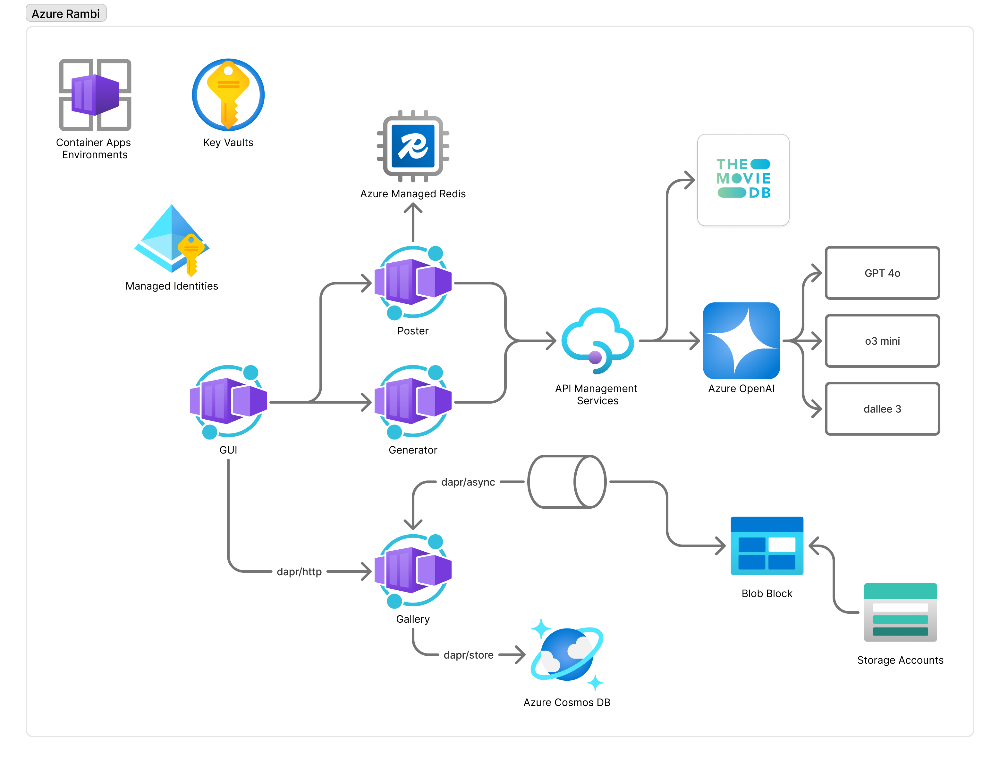

[](https://vscode.dev/redirect?url=vscode://ms-vscode-remote.remote-containers/cloneInVolume?url=https://github.com/bmoussaud/azure-rambi)

# Azure Rambi

Welcome to the Azure Rambi project! This repository contains code and resources for managing and deploying the Rambi Application using Azure services.


## Table of Contents

- [Introduction](#introduction)
- [Getting Started](#getting-started)
- [Installation](#installation)
- [Usage](#usage)
- [Contributing](#contributing)
- [License](#license)

## Introduction

Azure Rambi is a project designed to simplify the management and deployment of Azure resources. It provides a set of tools and scripts to automate common tasks.

## Getting Started

To get started with Azure Rambi, follow these steps:

1. Clone the repository:
    ```bash
    git clone https://github.com/bmoussaud/azure-rambi.git
    ```
2. Navigate to the project directory:
    ```bash
    cd azure-rambi
    ```

## Deployment

Install the required dependencies by running:
```bash
az login
azd auth login
azd up           
? Enter a new environment name: dev
? Select an Azure Subscription to use: 1. fake-subscription (00000000-0000-0000-0000-000000000000)
? Select an Azure location to use: 21. (Europe) France Central (francecentral)
? Pick a resource group to use: Create a new resource group
? Enter a name for the new resource group: azrambi-dev
```

Warning: the provision phases include an APIM and A Redis Cache that can take a veryyyyyyy loooooong time to become available. Patience ! if it fails run the `azd up` command again.

```
  (✓) Done: Azure OpenAI: azrambi-openai-lmgne5e2wzmce (722ms)
  (✓) Done: Container Registry: azurerambilmgne5e2wzmce (1.019s)
  (✓) Done: Key Vault: rambikvlmgne5e2wzmce (644ms)
  (✓) Done: Storage account: azrambilmgne5e2wzmce (769ms)
  (✓) Done: Azure AI Services Model Deployment: azrambi-openai-lmgne5e2wzmce/gpt-4o (634ms)
  (✓) Done: Azure AI Services Model Deployment: azrambi-openai-lmgne5e2wzmce/dall-e-3 (1.447s)
  (✓) Done: Azure AI Services Model Deployment: azrambi-openai-lmgne5e2wzmce/o1-mini (1.962s)
  (✓) Done: Log Analytics workspace: azure-rambi-log-analytics (230ms)
  (✓) Done: Event Hubs Namespace: azure-rambi-ehn-lmgne5e2wzmce (531ms)
  (✓) Done: Cache for Redis: azure-rambi-redis-lmgne5e2wzmce (1.223s)
  (✓) Done: Application Insights: azure-rambi-app-insights (1.095s)
  (✓) Done: Container Apps Environment: azure-rambi (17.733s)
  (✓) Done: Azure API Management: azrambi-apim-lmgne5e2wzmce (22.287s)
  (✓) Done: Azure Cosmos DB: azrambi-cosmos-dbaccount (818ms)
  (✓) Done: Container App: gui-svc (17.619s)
  (✓) Done: Container App: movie-poster-svc (17.052s)
  (✓) Done: Container App: movie-gallery-svc (16.767s)
  (✓) Done: Container App: movie-generator-svc (18.336s)

Deploying services (azd deploy)

  (✓) Done: Deploying service gui_svc
  - Endpoint: https://gui-svc.ashybay-1b7f1976.francecentral.azurecontainerapps.io/

  (✓) Done: Deploying service movie_gallery_svc
  - Endpoint: https://movie-gallery-svc.ashybay-1b7f1976.francecentral.azurecontainerapps.io/

  (✓) Done: Deploying service movie_generator_svc
  - Endpoint: https://movie-generator-svc.ashybay-1b7f1976.francecentral.azurecontainerapps.io/

  (✓) Done: Deploying service movie_poster_svc
  - Endpoint: https://movie-poster-svc.ashybay-1b7f1976.francecentral.azurecontainerapps.io/
```

To open the application, click on the link below the `Done: Deploying service gui` 



### Troobleshooting configuration

```
az deployment group create  --template-file infra/user_portal_role.bicep --resource-group $( azd env get-value AZURE_RESOURCE_GROUP )
```

### Configure Github actions

2. `gh auth login`
3. Execute `infra/configure_authenticate_github_actions.sh .azure/dev/.env`

### Azure Infrastructue

The [infra/main.bicep](infra/main.bicep)
* CognitiveServices 
    * Open AI gpt-4
    * Open AI o1-mini
    * Open AI dall-e-3
* Container Registry
* Azure Container Apps Environment
* Container Apps
    * gui: the frontend
    * movie_poster_svc : service managing the poster description and the poster generation
    * movie_generator_svc: service managing the movie generation.
* API Management
* Application Insight
* Key Vault
* Storag Account (Blob Storage)

The [infra/user_portal_role.bicep](infra/user_portal_role.bicep) grants to the current authenticated user the right to browse the content of the `keyvault` and the `blob storage` using the Azure portal.

### GitHub Credentials

edit the file [infra/authenticate_with_Azure_App_Service_for_GitHub.sh](infra/authenticate_with_Azure_App_Service_for_GitHub.sh) with your context and run it to grant a contributor to the resource group and to generate the secrets used by the GitHub action pipeline to deploy the differents components.
* `AZURE_CREDENTIALS` 
* `AZURE_SUBSCRIPTION_ID`

### Front GUI

* Service: Azure Application Service using the python runtime on linux
* CI/CD Pipeline: [.github/workflows/main_azure-rambi.yml](.github/workflows/main_azure-rambi.yml)

### API Management

Note: The bicep files come from: https://github.com/microsoft/AzureOpenAI-with-APIM/

#### TMDB

The OpenAPI json file is available here: https://developer.themoviedb.org/openapi. You'll find the file for [v3](https://developer.themoviedb.org/openapi/64542913e1f86100738e227f) and [v4](https://developer.themoviedb.org/openapi/6453cc549c91cf004cd2a015) version

### Movie Generator Service

The `generate_movie` method has been moved to a new FastAPI service located in `src/movie_generator_svc`. This service is configured to run in Azure Container Apps.

#### Deployment

To deploy the new `movie_generator_svc` service, follow these steps:

1. Build the Docker image:
    ```bash
    docker build -t movie_generator_svc:latest src/movie_generator_svc
    ```

2. Push the Docker image to your container registry:
    ```bash
    docker tag movie_generator_svc:latest <your-container-registry>/movie_generator_svc:latest
    docker push <your-container-registry>/movie_generator_svc:latest
    ```

3. Update the Azure Container Apps configuration to use the new image.

#### Usage

To use the new `movie_generator_svc` service, make a POST request to the `/generate` endpoint with the following JSON payload:
```json
{
    "movie1": {
        "title": "Movie 1 Title",
        "plot": "Movie 1 Plot",
        "poster_url": "Movie 1 Poster URL"
    },
    "movie2": {
        "title": "Movie 2 Title",
        "plot": "Movie 2 Plot",
        "poster_url": "Movie 2 Poster URL"
    },
    "genre": "Desired Genre"
}
```

The service will return a JSON response with the generated movie details.

## Clean up

```sh
azd down --force --purge
```

## Contributing

We welcome contributions! Please read our [contributing guidelines](CONTRIBUTING.md) for more details.

## License

This project is licensed under the MIT License. See the [LICENSE](LICENSE) file for more information.

```
  - name: Build the image in the Azure Containe Registry
    id: acr
    uses: azure/acr-build@v1
    with:
      service_principal: ${{ secrets.AZURE_SERVICE_PRINCIPAL_ID }}
      service_principal_password: ${{ secrets.AZURE_SERVICE_PRINCIPAL_PASSWORD }}
      tenant: ${{ secrets.AZURE_TENANT_ID }}
      registry: ${{ env.ACR_NAME }}
      repository: azure-rambi
      image: movie_poster_svc
      tag: ${{ github.sha }}
      folder: src/movie_poster_svc
      git_access_token: ${{ secrets.GITHUB_TOKEN }}
      branch: main
```      

## References:

### DAPR

* https://azureossd.github.io/2024/02/12/Container-Apps-General-troubleshooting-with-Dapr-on-Container-Apps/
* https://github.com/Azure/aca-dotnet-workshop
* https://docs.dapr.io/developing-applications/building-blocks/state-management/howto-state-query-api/
* https://github.com/Azure-Samples/Tutorial-Deploy-Dapr-Microservices-ACA/blob/main/azuredeploy.bicep


